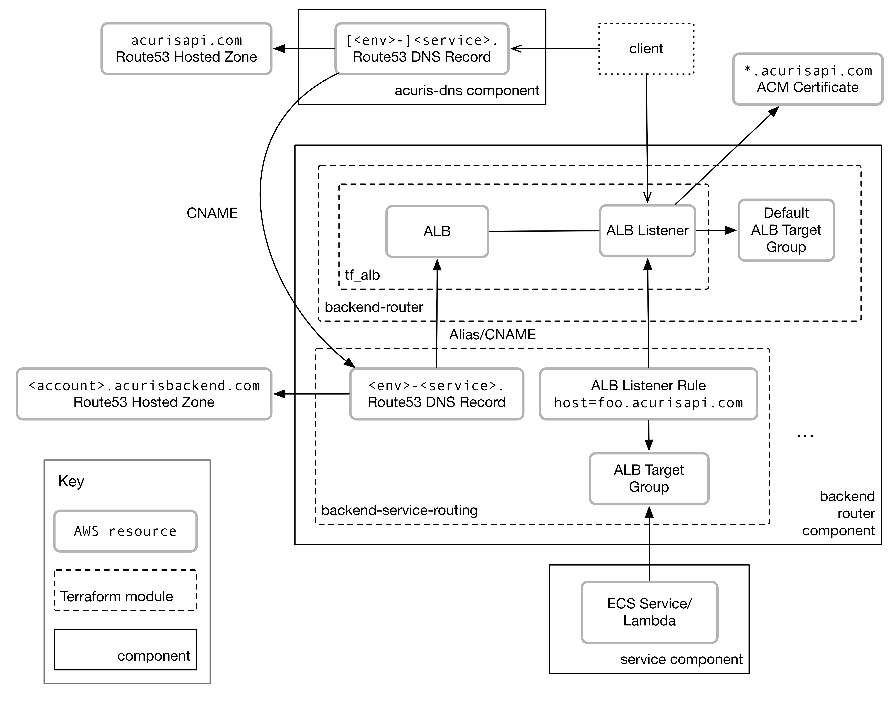

Backend Router Terraform module
===============================

[](https://github.com/mergermarket/terraform-acuris-backend-router/actions/workflows/test.yml)

This module creates a Backend Router service which, in effect, is a shared ALB to which individual services can be attached.
Ideally, there should be a single Backend Router per Team (e.g. platform-backend-router).

The Backend Router consists of:

- an ALB
- default, HTTPS Listener, with a certificate as per `dns_domain` parameter, by default diverting traffic to `404` ECS Service

Services attached to this ALB should be using `host-based` conditions for routing, rather than `path-based`.

Module Input Variables
----------------------

### Required Variables

- `team` - (string) - **REQUIRED** - Name of Team deploying the ALB - will affect ALBs name
- `env` - (string) - **REQUIRED** - Environment deployed to
- `component` - (string) - **REQUIRED** - Component name
- `certificate_domain_name` - (string) - **REQUIRED** - DNS domain name to use for SSL certificate

### Optional Variables

- `platform_config` - (map(string)) - Platform configuration dictionary (default: `{}`)
- `aws_region` - (string) - AWS Region (default: `"eu-west-1"`)
- `alb_internal` - (string) - If true, the LB will be internal (default: `"true"`)
- `extra_security_groups` - (list(string)) - Extra Security Groups to attach to the ALB (default: `[]`)
- `idle_timeout` - (string) - The time in seconds that the connection is allowed to be idle (default: `"60"`)
- `alb_ssl_policy` - (string) - The SSL policy for the ALB (default: `"ELBSecurityPolicy-TLS13-1-2-Res-2021-06"`)
- `run_data` - (bool) - Used to switch off data resources when unit testing (default: `true`)

### Default Target Group Variables

- `default_target_group_deregistration_delay` - (string) - The amount time for Elastic Load Balancing to wait before changing the state of a deregistering target from draining to unused. Range is 0-3600 seconds (default: `"10"`)
- `default_target_group_health_check_interval` - (string) - The approximate amount of time, in seconds, between health checks of an individual target. Min 5, Max 300 seconds (default: `"5"`)
- `default_target_group_health_check_path` - (string) - The destination for the health check request (default: `"/internal/healthcheck"`)
- `default_target_group_health_check_timeout` - (string) - The amount of time, in seconds, during which no response means a failed health check (default: `"4"`)
- `default_target_group_health_check_healthy_threshold` - (string) - The number of consecutive health checks successes required before considering an unhealthy target healthy (default: `"2"`)
- `default_target_group_health_check_unhealthy_threshold` - (string) - The number of consecutive health check failures required before considering the target unhealthy (default: `"2"`)
- `default_target_group_health_check_matcher` - (string) - The HTTP codes to use when checking for a successful response from a target (default: `"200-299"`)

Usage
-----

```hcl
module "backend_router" {
  source  = "mergermarket/backend-router/acuris"
  version = "0.2.1"

  team                    = "footeam"
  env                     = "fooenv"
  component               = "foocomponent"
  platform_config         = var.platform_config
  certificate_domain_name = "domain.com"
}
```

Outputs
-------

- `alb_dns_name` - The DNS name of the load balancer
- `alb_arn` - The AWS ARN of the load balancer
- `alb_listener_arn` - The ARN of the load balancer listener
- `default_target_group_arn` - The ARN of the target group

Architecture
------------

This module is the `backend-router` box in the diagram below:


